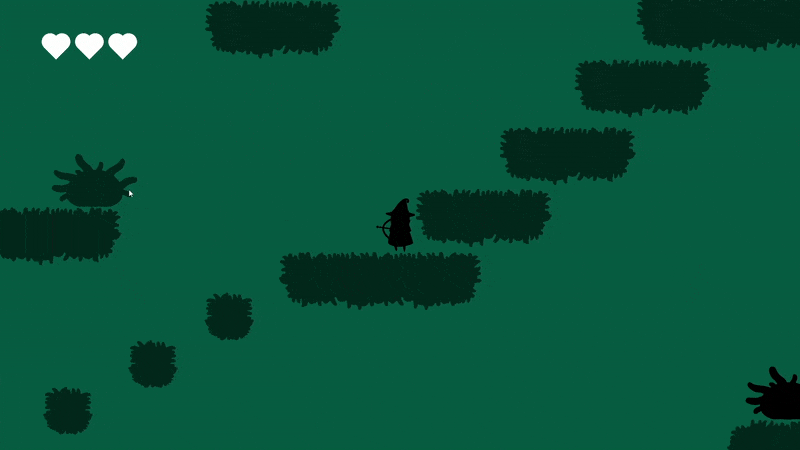

# Eclipse Game Engine

XNA/MonoGame 2D game engine built with Entity Component System (ECS) architecture principles similar to Unity, featuring advanced weapon systems, physics, and VFX.

## Key Features

### Core Systems
- **Entity Component System (ECS)** Architecture
- **Scene Management** with SceneGraph hierarchy
- **Physics System** with collision detection and response
- **Input System** with controller support
- **Audio System** with 3D sound positioning
- **VFX System** with particle effects
- **UI System** with widgets and canvas management
- **Debug System** with visual debugging tools

### Graphics & Rendering
- Optimized rendering pipeline
- Sprite animation system
- Custom shaders (Outline, Color modification)
- Debug renderer
- UI rendering system
- Camera system with smooth following

### Game Systems

- **Weapon System**
  - Multiple weapon types (Bow, Blade, Projectile weapons)
  - Weapon states and animations
  - Charging mechanics
  - Audio integration
  - Projectile pooling
- **Combat System**
  - Damage dealing
  - Collision detection
  - Element states (Light, Dark, Neutral)
  - Hit detection and response
- **Animation System**
  - Sprite animation
  - Transform animation
  - State-based animations
  - Animation queuing

### Asset Management
- Asset loading pipeline
- Texture atlas support
- Audio clip management
- Tiled map integration
- JSON configuration system

### Technical Features
- Object pooling system
- Factory pattern implementation
- Singleton manager system
- Component-based architecture
- Event system
- Save/Load system
- Settings management

## Implementation Highlights

- **Advanced Pooling System**: Efficient object reuse for projectiles and particles
- **Flexible Factory System**: Template-based factory pattern for game object creation
- **Robust Scene Management**: Hierarchical scene graph with transform inheritance
- **Complete Audio System**: 3D positional audio with music and sound effect support
- **Comprehensive Settings**: User-configurable options with save/load functionality
- **Debug Tools**: Visual debugging system for development and testing

## Tools Integration

- Texture Atlas Packer
- Tiled Map Editor
- Custom Debug Tools
